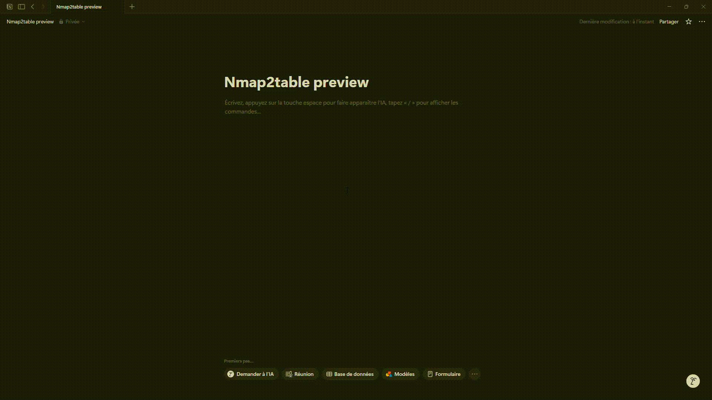

# 🛠️ Nmap2table

[](https://www.python.org/downloads/)
[](https://opensource.org/licenses/MIT)

**Un simple script Python pour convertir un scan Nmap (XML) en un tableau markdown clair et lisible.**

*🌍 [English version available here](README.md)*

## Notion preview

<div align="center">
  
</div>

---

## 🗂️ Sommaire
- [Objectif](#objectif)
- [Exemple](#exemple)
- [Structure du projet](#structure-du-projet)
- [Installation](#installation)
- [Fonctionnement](#fonctionnement)
- [Utilisation](#utilisation)
- [Licence](#licence)

## Objectif

**Nmap2table** permet de transformer les résultats d’un scan Nmap au format XML en un tableau markdown propre, idéal pour :

- Les rapports de pentest
- La prise de notes dans Notion, Obsidian ou HackMD
- Les compétitions CTF

---

## Exemple

```bash
$ python -m src.main scan.xml output.md
```

Résultat markdown (cf. output.md) :

### Host : 10.10.6.53

| Port | Protocol | State | Service | Version |
|------|----------|-------|---------|---------|
| 135 | tcp | open | msrpc | Microsoft Windows RPC
| 139 | tcp | open | netbios-ssn | Microsoft Windows netbios-ssn
| 445 | tcp | open | microsoft-ds | Windows 7 Professional 7601 Service Pack 1 microsoft-ds
| 3389 | tcp | open | ms-wbt-server | Microsoft Terminal Service
| 5357 | tcp | open | http | Microsoft HTTPAPI httpd2.0
| 8000 | tcp | open | http | Icecast streaming media server
| 49152 | tcp | open | msrpc | Microsoft Windows RPC
| 49153 | tcp | open | msrpc | Microsoft Windows RPC
| 49154 | tcp | open | msrpc | Microsoft Windows RPC
| 49158 | tcp | open | msrpc | Microsoft Windows RPC
| 49159 | tcp | open | msrpc | Microsoft Windows RPC
| 49161 | tcp | open | msrpc | Microsoft Windows RPC

```bash
Port 3389 :
rdp-ntlm-info:

  Target_Name: DARK-PC
  NetBIOS_Domain_Name: DARK-PC
  NetBIOS_Computer_Name: DARK-PC
  DNS_Domain_Name: Dark-PC
  DNS_Computer_Name: Dark-PC
  Product_Version: 6.1.7601
  System_Time: 2025-07-23T11:52:22+00:00

ssl-date:
2025-07-23T11:52:27+00:00; +1s from scanner time.

ssl-cert:
Subject: commonName=Dark-PC
Not valid before: 2025-07-22T11:47:43
Not valid after:  2026-01-21T11:47:43

Port 5357 :
http-title:
Service Unavailable

http-server-header:
Microsoft-HTTPAPI/2.0

Port 8000 :
http-title:
Site doesn't have a title (text/html).

```

---

## Structure du projet

```
Nmap2table/
├── src/
│   ├── main.py           # Script principal
│   ├── parser.py         # Extraction des données XML
├── utils/
│   └── markdown.py       # Génération Markdown
├── tests/
│   └── data/
│       └── sample_nmap.xml # Fichier de test
├── README.md
├── .gitignore
```

---

## Installation

```bash
git clone https://github.com/0xMR007/Nmap2table.git
cd Nmap2table
```

---

## Fonctionnement

1. Lis un fichier XML généré par Nmap (`nmap -oX scan.xml`)
2. Extrait les hôtes, ports, services et scripts NSE
3. Génère un fichier markdown clair et lisible

---

## Utilisation

```bash
python -m src.main scan.xml output.md
```

---

## Licence

MIT – Utilisation libre avec attribution

---

<div align="center">

**⭐ Star this repo if Nmap2table helps you during your CTFs/pentests**

<i>Fait avec ❤️ par un étudiant passioné<i>
</div>
